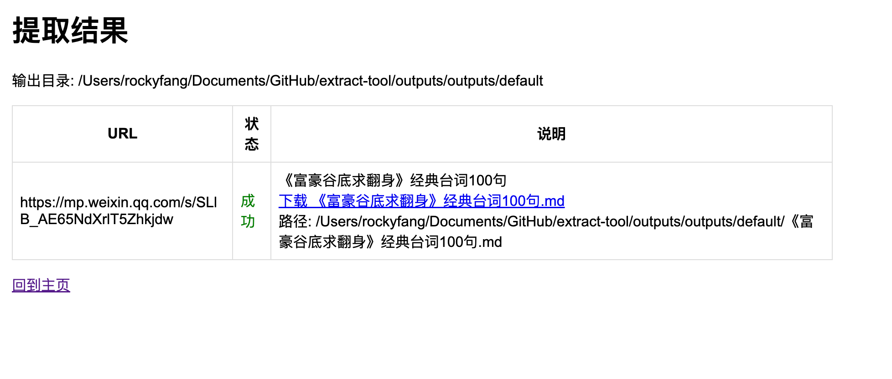

# 微信公众号文章快速提取器 — Web & CLI

轻量的微信公众号文章提取工具，包含：
- `wechat_extract.py`：命令行 / 可被导入的提取模块（提取标题、作者、日期、正文 HTML/Markdown、图片列表并可选择下载图片）。
- `app.py`：基于 Flask 的简单 Web 界面，支持批量/单篇提取、设置默认保存路径并提供下载。
- `templates/`：Flask 模板（index/result/settings）。
- `config.json`：默认输出路径配置（可通过 Web 界面修改）。
- `outputs/`：默认输出根目录（运行时写入）。
- `docs/screenshots/`：UI 截图（已上传到仓库，用于 README 预览）。

适合快速将公开的 mp.weixin.qq.com 文章抓取并导出为 Markdown/HTML/JSON，或通过 Web 页面交互使用。

> 注意：请仅在你有合法权限的情况下抓取内容并遵守目标站点服务条款与版权法规。该工具不会绕过登录/付费限制或付费墙。

---

## 功能概览

- 提取文章元信息：标题、作者、发布日期、正文（HTML / Markdown）、图片列表。
- CLI 与 Web 两种使用方式（同一套核心代码）。
- 可选下载文章中的图片并将 src 替换为本地路径。
- 批量处理（支持从多行文本或 CSV 读取 URL）。
- Web 界面支持设置并持久化默认输出路径（保存到 `config.json`），并限制输出写入项目的 `outputs` 子目录以提升安全性。

---

## 快速开始

先决条件
- Python 3.8+
- 建议在虚拟环境中运行

安装依赖：
```bash
python -m venv .venv
source .venv/bin/activate        # macOS / Linux
# .venv\Scripts\activate         # Windows PowerShell
pip install -r requirements.txt
```

命令行示例（单篇）：
```bash
python wechat_extract.py --url "https://mp.weixin.qq.com/s/XXXXXXXX" --outdir output --format md
```

命令行示例（批量，从 urls.txt 每行一个 URL）：
```bash
python wechat_extract.py --input urls.txt --outdir output --format html --download-images --workers 4
```

启动 Web 界面：
```bash
python app.py
```
在浏览器打开：http://127.0.0.1:5000

在 Web 界面中可以：
- 输入单个 URL 或多行 URL 批量提取
- 选择输出格式（md / html / json）
- 勾选是否下载图片
- 设置输出目录（可在 Settings 页面设为默认路径）

默认输出目录：项目下的 `outputs` 子目录（`config.json` 中的 `default_outdir`，初始为 `outputs/default`）。

---

## 页面示例（仓库内截图）

仓库中已包含两张界面截图，路径为 `docs/screenshots/`。以下图片直接引用仓库内文件，方便其他用户在 GitHub 页面上查看效果预览。

提取结果页预览（示例）：



主页面 / 提取表单（示例）：


> 如果你在本地运行并想替换这两张图片，请把新的截图放到 `docs/screenshots/index.png` 与 `docs/screenshots/result.png`，然后提交到仓库。

---

## 文件与目录说明

- `wechat_extract.py` — 提取器模块（也包含 CLI 接口）
- `app.py` — Flask Web 应用
- `templates/`
  - `index.html` — 主页面
  - `result.html` — 结果展示页
  - `settings.html` — 设置页（默认保存路径）
- `config.json` — 保存默认配置（default_outdir）
- `requirements.txt` — Python 依赖
- `outputs/` — Web 应用允许写入的导出根目录（runtime）
- `docs/screenshots/` — 存放 README 使用的界面截图

---

## 配置与安全建议

- `config.json` 用于持久化默认路径；默认值为 `outputs/default`。Web 应用会把所有导出限制在 `outputs` 根目录下，避免写入任意系统路径（提高安全性）。
- 请在生产环境替换 Flask 的 `secret_key`（不要把生产密钥写入公共仓库）。
- 对于大量任务或长时间任务，建议使用后台任务队列（Celery / RQ）并通过任务 ID 让前端轮询结果，而不是在请求中阻塞（当前实现为简单同步等待）。
- 提供下载接口时请注意访问控制（在公网部署请加认证或反向代理限制）。

---

## 部署建议

本项目可以通过多种方式部署：

- 开发/本地测试：直接运行 `python app.py`（debug 模式，勿用于生产）。
- 生产部署建议使用 WSGI 服务器（gunicorn / uvicorn）+ 反向代理（nginx），并运行在非 debug 模式下。
- 容器化：可以为该项目添加 `Dockerfile`，将 Python 依赖安装并以 gunicorn 启动 `app:app`；我可以根据需要为你生成 Dockerfile 和 docker-compose 配置。

示例（使用 gunicorn 启动）：
```bash
gunicorn -w 4 -b 0.0.0.0:8000 app:app
```

---

## 常见问题

Q: 页面抓取失败 / 返回空内容？  
A: 部分公众号页面使用了更复杂的防爬或 JS 渲染。遇到这种情况：
- 尝试在浏览器中打开并查看页面源代码，或使用浏览器自动化（Selenium / Playwright）来获取渲染后的 HTML。
- 在 CLI 中适当设置 headers、Referer 或使用代理。

Q: 图片下载失败？  
A: 检查网络、目标资源是否受限或图片 URL 是否需要特殊 headers。下载图片可能会被 CDN 或防盗链策略拦截，Referer 有时能帮忙。

Q: 想要 OCR 或从视频中提取文字？  
A: 该仓库主要面向公众号文章。若要处理视频（例如视频号 OCR），建议结合 `yt-dlp`、`ffmpeg`、`pytesseract` 等工具，我可以为你单独提供脚本或将其集成到本项目中。

---

## 贡献

欢迎提交 issues 或 PR：
- bug 修复、改进提取逻辑（更多页面结构支持）
- 把长任务改为异步队列（Celery / Redis）
- 增加 Dockerfile / CI 配置 / 更友好的前端（进度显示、文件上传）

---

## 许可

请在仓库中添加合适的 LICENSE 文件（例如 MIT / Apache-2.0），以明确开源许可条款。如果你需要，我可以为该项目生成一个标准的 LICENSE 文件。

---
